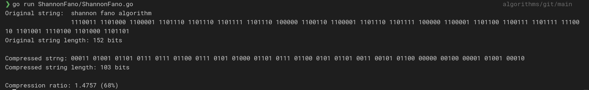

# Shannon-Fano coding algorithm

```Go
    func main() {
        testString := "shannon fano algorithm"
        shanonFanoCode := NewShannonFanoCode(testString)

        fmt.Println(shannonFanoCode)
    }
```

## Example


<!--  -->
