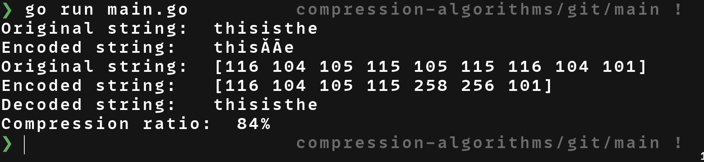

# LZW Algorithm

Example

```Go
package main

import (
	"fmt"

	"github.com/2thousandmax/compression-algorithms/lzw"
)

func main() {
	originalString := "thisisthe"
	encodedString := lzw.Encode(originalString)
	fmt.Println("Original string: ", originalString)
	fmt.Println("Encoded string:  ", string(encodedString))

	decodedString, _ := lzw.Decode(encodedString)
	fmt.Println("Decoded string:  ", decodedString)
```

